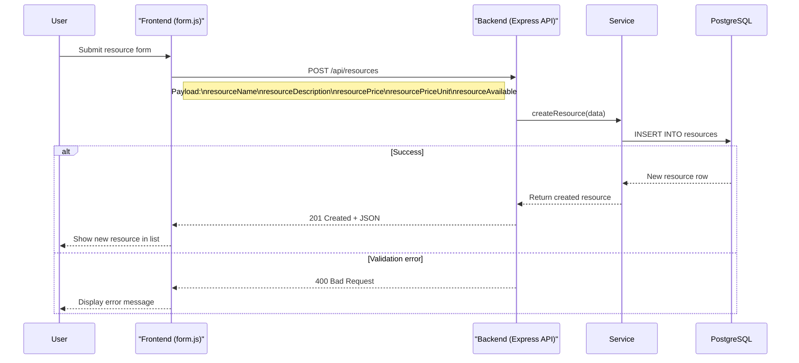
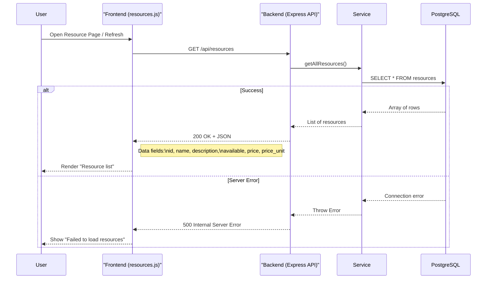
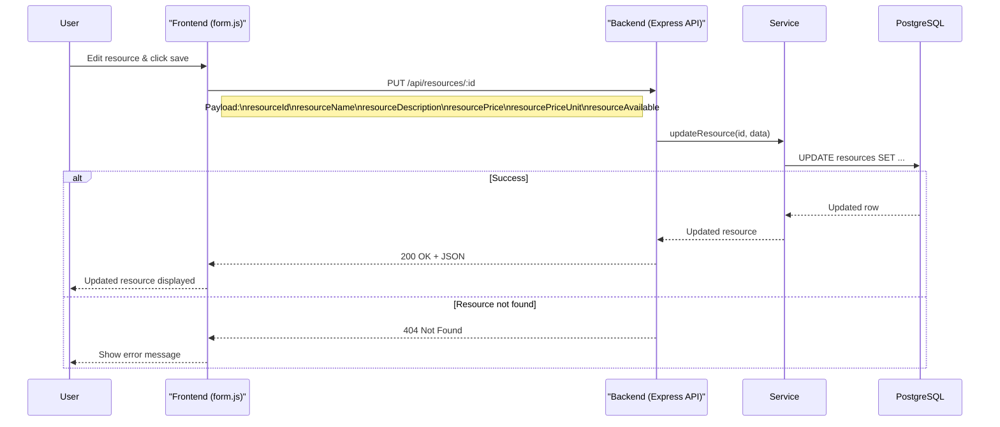
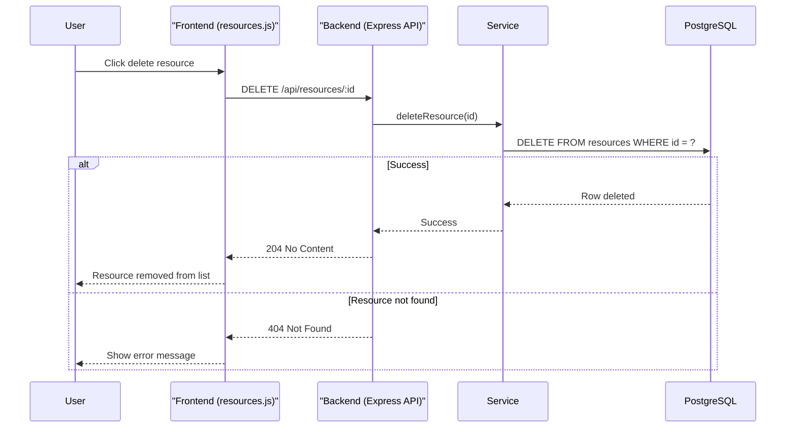

# CREATE

```mermaid
sequenceDiagram
    participant User
    participant Frontend_form as "Frontend (form.js)"
    participant Backend_API as "Backend (Express API)"
    participant Service
    participant PostgreSQL

    User->>Frontend_form: Submit resource form
    Frontend_form->>Backend_API: POST /api/resources

    Note right of Frontend_form: Payload:\nresourceName\nresourceDescription\nresourcePrice\nresourcePriceUnit\nresourceAvailable

    Backend_API->>Service: createResource(data)
    Service->>PostgreSQL: INSERT INTO resources

    alt Success
        PostgreSQL-->>Service: New resource row
        Service-->>Backend_API: Return created resource
        Backend_API-->>Frontend_form: 201 Created + JSON
        Frontend_form-->>User: Show new resource in list
    else Validation error
        Backend_API-->>Frontend_form: 400 Bad Request
        Frontend_form-->>User: Display error message
    end
```

# READ

```mermaid
sequenceDiagram
    participant User
    participant Frontend_resources as "Frontend (resources.js)"
    participant Backend_API as "Backend (Express API)"
    participant Service
    participant PostgreSQL

    User->>Frontend_resources: Open Resource Page / Refresh
    Frontend_resources->>Backend_API: GET /api/resources

    Backend_API->>Service: getAllResources()
    Service->>PostgreSQL: SELECT * FROM resources

    alt Success
        PostgreSQL-->>Service: Array of rows
        Service-->>Backend_API: List of resources
        Backend_API-->>Frontend_resources: 200 OK + JSON

        Note right of Frontend_resources: Data fields:\nid, name, description,\navailable, price, price_unit

        Frontend_resources-->>User: Render "Resource list"
    else Server Error
        PostgreSQL-->>Service: Connection error
        Service-->>Backend_API: Throw Error
        Backend_API-->>Frontend_resources: 500 Internal Server Error
        Frontend_resources-->>User: Show "Failed to load resources"
    end
```

# UPDATE

```mermaid
sequenceDiagram
    participant User
    participant Frontend_form as "Frontend (form.js)"
    participant Backend_API as "Backend (Express API)"
    participant Service
    participant PostgreSQL

    User->>Frontend_form: Edit resource & click save
    Frontend_form->>Backend_API: PUT /api/resources/:id

    Note right of Frontend_form: Payload:\nresourceId\nresourceName\nresourceDescription\nresourcePrice\nresourcePriceUnit\nresourceAvailable

    Backend_API->>Service: updateResource(id, data)
    Service->>PostgreSQL: UPDATE resources SET ...

    alt Success
        PostgreSQL-->>Service: Updated row
        Service-->>Backend_API: Updated resource
        Backend_API-->>Frontend_form: 200 OK + JSON
        Frontend_form-->>User: Updated resource displayed
    else Resource not found
        Backend_API-->>Frontend_form: 404 Not Found
        Frontend_form-->>User: Show error message
    end
```

# DELETE

```mermaid
sequenceDiagram
    participant User
    participant Frontend_resources as "Frontend (resources.js)"
    participant Backend_API as "Backend (Express API)"
    participant Service
    participant PostgreSQL

    User->>Frontend_resources: Click delete resource
    Frontend_resources->>Backend_API: DELETE /api/resources/:id

    Backend_API->>Service: deleteResource(id)
    Service->>PostgreSQL: DELETE FROM resources WHERE id = ?

    alt Success
        PostgreSQL-->>Service: Row deleted
        Service-->>Backend_API: Success
        Backend_API-->>Frontend_resources: 204 No Content
        Frontend_resources-->>User: Resource removed from list
    else Resource not found
        Backend_API-->>Frontend_resources: 404 Not Found
        Frontend_resources-->>User: Show error message
    end
```
``
