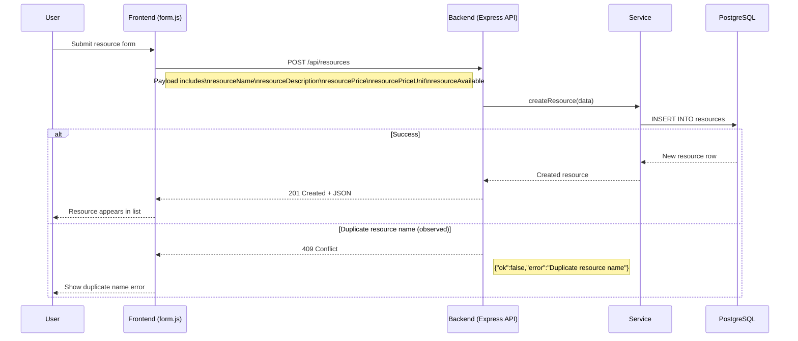
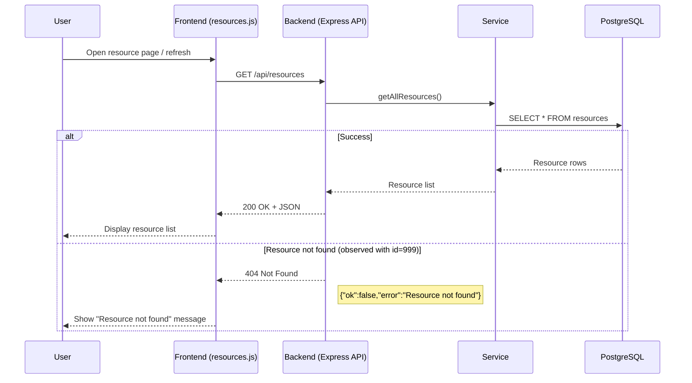
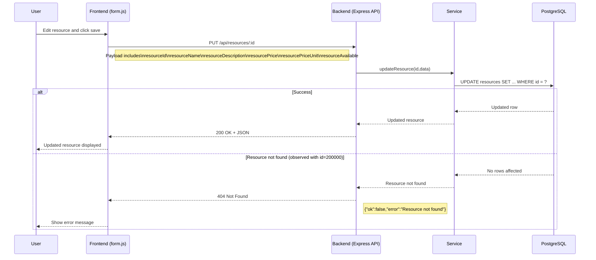
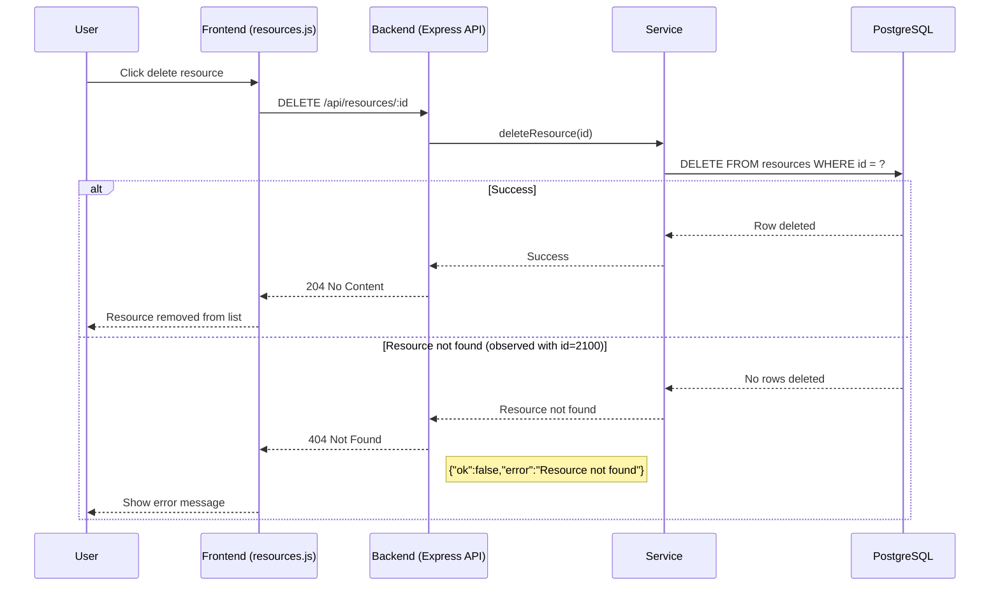

---

## CREATE Resource

```mermaid
sequenceDiagram
    participant User
    participant Frontend (form.js)
    participant Backend (Express API)
    participant Service
    participant PostgreSQL

    User->>Frontend (form.js): Submit resource form
    Frontend (form.js)->>Backend (Express API): POST /api/resources

    Note right of Frontend (form.js): Payload includes\nresourceName\nresourceDescription\nresourcePrice\nresourcePriceUnit\nresourceAvailable

    Backend (Express API)->>Service: createResource(data)
    Service->>PostgreSQL: INSERT INTO resources

    alt Success
        PostgreSQL-->>Service: New resource row
        Service-->>Backend (Express API): Created resource
        Backend (Express API)-->>Frontend (form.js): 201 Created + JSON
        Frontend (form.js)-->>User: Resource appears in list

    else Duplicate resource name (observed)
        Backend (Express API)-->>Frontend (form.js): 409 Conflict
        Note right of Backend (Express API): {"ok":false,"error":"Duplicate resource name"}
        Frontend (form.js)-->>User: Show duplicate name error

    end
```

---

## READ Resources

```mermaid
sequenceDiagram
    participant User
    participant Frontend (resources.js)
    participant Backend (Express API)
    participant Service
    participant PostgreSQL

    User->>Frontend (resources.js): Open resource page / refresh
    Frontend (resources.js)->>Backend (Express API): GET /api/resources

    Backend (Express API)->>Service: getAllResources()
    Service->>PostgreSQL: SELECT * FROM resources

    alt Success
        PostgreSQL-->>Service: Resource rows
        Service-->>Backend (Express API): Resource list
        Backend (Express API)-->>Frontend (resources.js): 200 OK + JSON
        Frontend (resources.js)-->>User: Display resource list

    else Resource not found (observed with id=999)
        Backend (Express API)-->>Frontend (resources.js): 404 Not Found
        Note right of Backend (Express API): {"ok":false,"error":"Resource not found"}
        Frontend (resources.js)-->>User: Show "Resource not found" message

    end
```

---

## UPDATE Resource

```mermaid
sequenceDiagram
    participant User
    participant Frontend (form.js)
    participant Backend (Express API)
    participant Service
    participant PostgreSQL

    User->>Frontend (form.js): Edit resource and click save
    Frontend (form.js)->>Backend (Express API): PUT /api/resources/:id

    Note right of Frontend (form.js): Payload includes\nresourceId\nresourceName\nresourceDescription\nresourcePrice\nresourcePriceUnit\nresourceAvailable

    Backend (Express API)->>Service: updateResource(id,data)
    Service->>PostgreSQL: UPDATE resources SET ... WHERE id = ?

    alt Success
        PostgreSQL-->>Service: Updated row
        Service-->>Backend (Express API): Updated resource
        Backend (Express API)-->>Frontend (form.js): 200 OK + JSON
        Frontend (form.js)-->>User: Updated resource displayed

    else Resource not found (observed with id=200000)
        PostgreSQL-->>Service: No rows affected
        Service-->>Backend (Express API): Resource not found
        Backend (Express API)-->>Frontend (form.js): 404 Not Found
        Note right of Backend (Express API): {"ok":false,"error":"Resource not found"}
        Frontend (form.js)-->>User: Show error message

    end
```

---

## DELETE Resource

```mermaid
sequenceDiagram
    participant User
    participant Frontend (resources.js)
    participant Backend (Express API)
    participant Service
    participant PostgreSQL

    User->>Frontend (resources.js): Click delete resource
    Frontend (resources.js)->>Backend (Express API): DELETE /api/resources/:id

    Backend (Express API)->>Service: deleteResource(id)
    Service->>PostgreSQL: DELETE FROM resources WHERE id = ?

    alt Success
        PostgreSQL-->>Service: Row deleted
        Service-->>Backend (Express API): Success
        Backend (Express API)-->>Frontend (resources.js): 204 No Content
        Frontend (resources.js)-->>User: Resource removed from list

    else Resource not found (observed with id=2100)
        PostgreSQL-->>Service: No rows deleted
        Service-->>Backend (Express API): Resource not found
        Backend (Express API)-->>Frontend (resources.js): 404 Not Found
        Note right of Backend (Express API): {"ok":false,"error":"Resource not found"}
        Frontend (resources.js)-->>User: Show error message

    end
```
